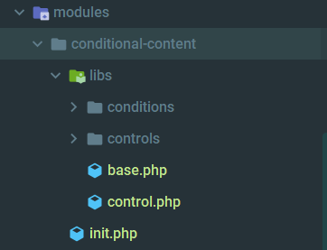

# Conditional Content

## Module Structure

Here down the conditional content module structure




This module has two parts , **controls** and **conditions** . **Control** folder container all the controls that will be added into **Elementor** editor and the **conditions** folder contain all the logical activity of the controls 

## Basic Control structure 

There are two type of controls in this module. Basic controls and Repeater Controls.


Basic Control must **extends** to **Control\_Base** and repeater control must extends to **Repeater\_Control\_Base**

### **Example of Basic Control**

```php
namespace ElementsKit\Modules\Conditional_Content\Libs\Controls;
use Elementor\Controls_Manager;
use Elementor\Element_Base;

class Condition_Relation extends Control_Base
{
    function get_control(Element_Base $element)
    {
        $element->add_control(
            $this->PREFIX . 'condition_enable',
            [
                'label' => __('Enable Condition', 'elementskit'),
                'type' => Controls_Manager::SWITCHER,
                'label_on' => __('On', 'elementskit'),
                'label_off' => __('Off', 'elementskit'),
                'return_value' => 'yes',
                'default' => '',
                'frontend_available' => true,
            ]
        );
    }
}
```

### **Example of Repeater Control**

```php
namespace ElementsKit\Modules\Conditional_Content\Libs\Controls;
use Elementor\Repeater;

class User_Role extends Repeater_Control_Base {

    function get_control(Repeater $repeater, $condition)
    {
        $repeater->add_control($this->PREFIX . 'condition_user_role', [
            'type' => \Elementor\Controls_Manager::SELECT,
            'options' => [
                'administrator' => 'Administrator',
                'author' => 'Author',
                'editor' => 'Editor',
                'contributor' => 'Contributor',
                'subscriber' => 'Subscriber',
            ],
            'default' => __('subscriber', 'elementskit'),
            'label_block' => true,
            'condition' => [
                $this->PREFIX . 'conditions_list' => $condition
            ]
        ]);
    }
}
```


 Both basic and repeater control will inside **controls** folder



More doc coming soon ....

